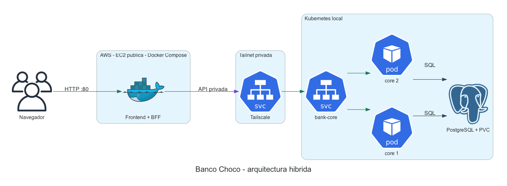

# Módulo 5 · Clase 2 — Banco Choco híbrido

En este laboratorio vamos a dividir una aplicación entre dos lugares:

- AWS publica el sitio web.
- Kubernetes local ejecuta el core bancario y PostgreSQL.
- Tailscale conecta ambos entornos de forma privada.

La idea principal es:

> Podemos llevar el canal web a la nube sin publicar ni mover el core y la base de datos.

## Recorrido

| Parte | Resultado |
|---|---|
| Preparar Tailscale | La red privada reconoce al operador. |
| Desplegar Kubernetes | El core y PostgreSQL funcionan localmente. |
| Crear la EC2 | Tenemos una VM pública en AWS. |
| Preparar la EC2 | Docker, Compose y Tailscale quedan instalados. |
| Levantar la aplicación | El frontend queda publicado en el puerto 80. |
| Probar una falla | Vemos qué ocurre si se corta la conexión privada. |

> La EC2 genera costo mientras esté encendida. Al final hay una sección de limpieza.

## Cómo descargar el laboratorio

    git clone https://github.com/formatec-c4/m5-clase2.git
    cd m5-clase2

## 1. Qué vamos a construir

### Qué es cada cosa

| Componente | Explicación simple |
|---|---|
| EC2 | Una máquina virtual que alquilamos en AWS. |
| Docker | Ejecuta aplicaciones dentro de contenedores. |
| Docker Compose | Es la receta que construye y levanta el contenedor. |
| Frontend | Es la página que ve el usuario. |
| BFF | Es la parte del frontend que llama al core en nombre del navegador. |
| Kubernetes | Ejecuta y mantiene los componentes locales. |
| Service | Es una dirección estable delante de uno o más pods. |
| Pod | Es una instancia de una aplicación en Kubernetes. |
| PostgreSQL | Guarda cuentas, saldos y transferencias. |
| PVC | Es el disco persistente de PostgreSQL. |
| Tailscale | Crea la red privada entre AWS y Kubernetes. |

No usamos Docker Swarm. Todo el lado de AWS funciona en una sola EC2.

Esta práctica es híbrida porque combina nube pública e infraestructura local. No es multi-cloud porque usamos un solo proveedor público.

## 2. Tailscale explicado simple

Tailscale crea una red privada entre equipos autorizados. Usa WireGuard para cifrar el tráfico.

Es parecido a conectar los equipos a una misma red local, aunque estén en lugares diferentes.

### Tailnet

La tailnet es toda nuestra red privada de Tailscale.

En este laboratorio contiene:

- la EC2 de AWS;
- el operador de Kubernetes;
- el proxy que representa al core bancario.

### Machine

Una machine es un equipo conectado a la tailnet.

La EC2 aparecerá como:

    formatec-aws-front

### Tag

Un tag es una etiqueta que dice qué función cumple una máquina.

Usamos:

| Tag | Significado |
|---|---|
| tag:k8s-operator | Este equipo es el operador. |
| tag:k8s | Este equipo fue creado por el operador. |
| tag:aws-front | Esta máquina es el frontend de AWS. |

Los tags después se usan para decidir quién puede comunicarse.

### Auth key

Una auth key es una clave de registro.

La usamos una sola vez para agregar la EC2 a Tailscale. Después de registrarse, la EC2 mantiene su propia identidad.

### OAuth

OAuth es la credencial del operador.

El operador no registra una sola máquina. Necesita poder crear y eliminar proxies cada vez que cambia Kubernetes. Por eso usa OAuth y no una auth key común.

### MagicDNS

MagicDNS es la agenda privada de Tailscale.

Convierte un nombre fácil:

    core-bancario

en la dirección privada correspondiente:

    100.x.x.x

Ese nombre solamente funciona para equipos conectados a la tailnet. No es un dominio público de Internet.

Gracias a MagicDNS, la EC2 no necesita recordar la IP privada del core.

### Operador de Tailscale

El operador es un programa que corre dentro de Kubernetes.

Observa los Services. Cuando encuentra uno que pide Tailscale, crea automáticamente un proxy.

### Proxy de Tailscale

El proxy es el puente entre la tailnet y el Service de Kubernetes.

No ejecuta operaciones bancarias. Solo recibe tráfico privado y lo entrega al core.

El recorrido queda así:

    EC2
      -> MagicDNS encuentra al core
      -> Tailscale cifra la conexión
      -> proxy dentro de Kubernetes
      -> Service bank-core
      -> uno de los pods

El core no necesita una IP pública.

## 3. Archivos del laboratorio

    m5-clase2/
    ├── app/
    │   ├── index.html
    │   └── server.py
    ├── assets/
    │   └── arquitectura-hibrida.png
    ├── k8s/
    │   ├── core-api.yaml
    │   ├── namespace.yaml
    │   └── postgres.yaml
    ├── policies/
    │   └── tailscale.hujson
    ├── compose.yaml
    ├── Dockerfile
    └── README.md

- app contiene el sitio y el BFF.
- k8s contiene el core y PostgreSQL.
- compose.yaml describe cómo construir y publicar el frontend.
- tailscale.hujson contiene los tags y permisos.

## 4. Revisar los requisitos

Necesitamos:

- acceso a AWS;
- acceso de administrador a Tailscale;
- Docker Desktop con Kubernetes habilitado;
- Helm y OpenSSL;
- permiso en AWS para usar EC2, IAM y Systems Manager.

Comprobar:

    kubectl config use-context docker-desktop
    kubectl get nodes
    kubectl get storageclass
    helm version

Deberíamos ver:

- contexto docker-desktop;
- nodos Ready;
- una StorageClass marcada como default, normalmente standard;
- una versión de Helm.

## 5. Preparar Tailscale

### 5.1 Cargar la política

1. Abrí https://console.tailscale.com/admin.
2. En el menú izquierdo entrá en Access controls.
3. Elegí el editor de política.
4. Abrí localmente el archivo policies/tailscale.hujson.
5. Copiá todo su contenido.
6. Reemplazá el contenido del editor de Tailscale.
7. Esperá que el editor no muestre errores.
8. Elegí Save.

La política crea los tres tags explicados antes.

Para simplificar la clase permitimos comunicación dentro de toda la tailnet. En producción usaríamos reglas más específicas.

Qué comprobar:

- tag:k8s-operator aparece como tag disponible;
- tag:k8s aparece como tag disponible;
- tag:aws-front aparece como tag disponible;
- la política fue guardada sin errores.

### 5.2 Crear la credencial del operador

1. Entrá en Settings → Trust credentials.
2. Elegí Add credential o Create credential.
3. Nombre: formatec-docker-desktop-operator.
4. En Scopes buscá Keys → Auth Keys y elegí Read and write.
5. Buscá Devices → Core y elegí Read and write.
6. Buscá General → Services y elegí Read and write.
7. En Tags elegí Add tags.
8. Seleccioná tag:k8s-operator.
9. Elegí Generate credential.
10. Guardá temporalmente el Client ID y el Client Secret.

¿Por qué hacemos esto?

El operador necesita permiso para crear los proxies de Kubernetes.

El Client Secret se muestra una sola vez. No debe guardarse en el repositorio.

No cierres esa pantalla hasta haber guardado ambos valores. Los usaremos una vez desde la terminal para instalar el operador.

## 6. Instalar el operador

Guardar temporalmente las credenciales:

    export TS_OAUTH_CLIENT_ID='pegar-client-id'
    export TS_OAUTH_CLIENT_SECRET='pegar-client-secret'

Instalar:

    helm repo add tailscale https://pkgs.tailscale.com/helmcharts
    helm repo update tailscale

    helm upgrade --install tailscale-operator tailscale/tailscale-operator \
      --namespace tailscale \
      --create-namespace \
      --set-string oauth.clientId="$TS_OAUTH_CLIENT_ID" \
      --set-string oauth.clientSecret="$TS_OAUTH_CLIENT_SECRET" \
      --wait \
      --timeout 5m

Borrar las variables:

    unset TS_OAUTH_CLIENT_ID TS_OAUTH_CLIENT_SECRET

Comprobar:

    kubectl get pods -n tailscale

Qué debería pasar:

- aparece un pod operator;
- queda Running;
- aparece tailscale-operator en Machines.

El operador ahora queda esperando Services que pidan conectividad Tailscale.

## 7. Crear los secretos de la aplicación

Generar un token y una contraseña:

    mkdir -p .lab

    openssl rand -hex 24 | tr -d '\n' > .lab/api-token
    openssl rand -hex 24 | tr -d '\n' > .lab/db-password

    chmod 600 .lab/api-token .lab/db-password

Crear el namespace y el Secret:

    kubectl apply -f k8s/namespace.yaml

    kubectl -n formatec-bank create secret generic bank-lab-secrets \
      --from-file=api-token=.lab/api-token \
      --from-file=db-password=.lab/db-password \
      --dry-run=client -o yaml | kubectl apply -f -

Qué estamos haciendo:

- el namespace agrupa los recursos del banco;
- el token protege la API;
- la contraseña protege PostgreSQL;
- los valores no quedan escritos en los YAML.

## 8. Desplegar PostgreSQL

    kubectl apply -f k8s/postgres.yaml

    kubectl -n formatec-bank rollout status \
      statefulset/bank-db \
      --timeout=5m

    kubectl -n formatec-bank get pod,service,pvc

El manifiesto crea:

| Recurso | Para qué sirve |
|---|---|
| ConfigMap | Guarda el SQL inicial. |
| StatefulSet | Ejecuta PostgreSQL. |
| Service | Le da un nombre estable. |
| PVC | Conserva los datos. |

Qué debería pasar:

- bank-db-0 queda Running;
- el PVC queda Bound;
- PostgreSQL no tiene IP pública.

## 9. Desplegar el core

    kubectl apply -f k8s/core-api.yaml

    kubectl -n formatec-bank rollout status \
      deployment/bank-core \
      --timeout=5m

    kubectl -n formatec-bank get pods
    kubectl -n formatec-bank get service bank-core
    kubectl -n tailscale get pods

Esta parte del Service activa al operador:

    type: LoadBalancer
    loadBalancerClass: tailscale

Significa: queremos publicar este Service mediante Tailscale.

El operador crea un proxy llamado ts-bank-core.

Obtener el hostname privado:

    kubectl -n formatec-bank get service bank-core \
      -o jsonpath='{.status.loadBalancer.ingress[0].hostname}{"\n"}'

Qué debería pasar:

- hay dos pods bank-core;
- aparece ts-bank-core en el namespace tailscale;
- aparece core-bancario en Tailscale Machines;
- el Service muestra un hostname privado.

## 10. Crear la EC2

### 10.1 Preparar el rol de Session Manager

Session Manager permite abrir una terminal desde la consola de AWS. No necesita una key pair ni el puerto SSH 22.

Si ya existe un perfil llamado `ec2-ssm-profile`, se puede reutilizar. Si no existe:

1. Abrí IAM → Roles.
2. Elegí Create role.
3. En Trusted entity type elegí AWS service.
4. En Use case elegí EC2.
5. Elegí Next.
6. Buscá y seleccioná `AmazonSSMManagedInstanceCore`.
7. Elegí Next.
8. Nombre del rol: `ec2-ssm-profile`.
9. Elegí Create role.

Ese permiso deja que la EC2 se registre en Systems Manager. No da acceso SSH y no abre puertos.

Amazon Linux 2023 ya incluye el agente de SSM. El agente se comunica hacia AWS mediante conexiones salientes HTTPS.

### 10.2 Lanzar la instancia

En AWS:

1. Cambiá la región a N. Virginia, us-east-1.
2. Abrí EC2 → Instances → Launch instances.
3. En Name and tags escribí formatec-aws-front.
4. En Application and OS Images elegí Amazon Linux.
5. Verificá que la AMI sea Amazon Linux 2023.
6. Verificá que la arquitectura sea 64-bit x86.
7. En Instance type elegí t3.micro.
8. En Key pair elegí Proceed without a key pair.
9. En Network settings elegí Edit.
10. En VPC seleccioná la que dice default.
11. En Subnet dejá No preference.
12. En Auto-assign public IP elegí Enable.
13. En Firewall elegí Create security group.
14. Nombre: formatec-m5-clase2-front.
15. Eliminá la regla SSH o cambiá su tipo a HTTP.
16. Verificá Tipo HTTP, puerto 80 y origen Anywhere IPv4.

Las reglas finales deben ser:

| Puerto | Origen | Para qué |
|---:|---|---|
| 80 | 0.0.0.0/0 | Abrir el sitio del laboratorio. |

17. En Configure storage dejá un volumen gp3 de 10 GiB.
18. En Advanced activá Encryption y elegí la clave predeterminada `aws/ebs`.
19. Abrí Advanced details.
20. En IAM instance profile elegí `ec2-ssm-profile`.
21. En Credit specification elegí Standard.
22. En Summary comprobá t3.micro, una instancia y 10 GiB.
23. Elegí Launch instance.
24. Volvé a EC2 → Instances.
25. Esperá Instance state: Running.
26. Esperá Status check: 2/2 checks passed.
27. Copiá la Public IPv4 address.

No abras el puerto 8000. Ese puerto pertenece al core privado.

Tampoco abrimos PostgreSQL 5432. La base solo recibe conexiones desde el core dentro de Kubernetes.

## 11. Entrar por Session Manager y descargar la aplicación

En AWS:

1. Abrí EC2 → Instances.
2. Seleccioná `formatec-aws-front`.
3. Elegí Connect.
4. Abrí la pestaña Session Manager.
5. Esperá que indique que la instancia está conectada.
6. Elegí Connect.

Se abre una terminal dentro del navegador. No usamos SSH, una key pair ni el puerto 22.

Comprobar la identidad:

    whoami
    hostname

Descargar el laboratorio desde GitHub:

    sudo dnf install -y git
    cd ~
    git clone https://github.com/formatec-c4/m5-clase2.git
    cd m5-clase2

Desde ahora, salvo que se indique lo contrario, los comandos de la EC2 se ejecutan en esa sesión del navegador.

## 12. Instalar Docker y Compose

Instalar Docker:

    sudo dnf update -y
    sudo dnf install -y docker
    sudo systemctl enable --now docker
    sudo docker version

Docker quedó iniciado ahora y también arrancará después de reiniciar la EC2.

Instalar Compose y Buildx:

    sudo mkdir -p /usr/local/lib/docker/cli-plugins

    sudo curl -SL \
      https://github.com/docker/compose/releases/download/v5.5.0/docker-compose-linux-x86_64 \
      -o /usr/local/lib/docker/cli-plugins/docker-compose

    sudo curl -SL \
      https://github.com/docker/buildx/releases/download/v0.37.1/buildx-v0.37.1.linux-amd64 \
      -o /usr/local/lib/docker/cli-plugins/docker-buildx

    sudo chmod +x \
      /usr/local/lib/docker/cli-plugins/docker-compose \
      /usr/local/lib/docker/cli-plugins/docker-buildx

    sudo docker compose version
    sudo docker buildx version

- Compose lee la receta compose.yaml.
- Buildx construye la imagen del frontend.

## 13. Instalar y conectar Tailscale

### 13.1 Instalar

    curl -fsSL \
      https://pkgs.tailscale.com/stable/amazon-linux/2023/tailscale.repo \
      | sudo tee /etc/yum.repos.d/tailscale.repo >/dev/null

    sudo dnf install -y tailscale
    sudo systemctl enable --now tailscaled
    sudo systemctl status tailscaled --no-pager

Esto instala:

- tailscaled: mantiene la conexión;
- tailscale: es el comando para controlarla.

Tailscale corre directamente en la EC2, no dentro de Docker.

### 13.2 Crear la auth key

En Tailscale:

1. Abrí Settings → Keys.
2. Elegí Generate auth key.
3. Description: formatec-aws-front.
4. Desactivá Reusable para que funcione una sola vez.
5. Desactivá Ephemeral para que la EC2 no desaparezca al desconectarse.
6. Si aparece Pre-approved, activalo.
7. En Tags seleccioná tag:aws-front.
8. Usá una expiración corta, por ejemplo un día.
9. Elegí Generate key.
10. Copiá la clave antes de cerrar la ventana.

Esta clave solamente incorpora la EC2 a la tailnet. No es la credencial OAuth del operador.

### 13.3 Registrar la EC2

    read -rsp 'Tailscale auth key: ' TS_AUTH_KEY
    echo

    sudo tailscale up \
      --auth-key="$TS_AUTH_KEY" \
      --hostname=formatec-aws-front \
      --accept-dns=true

    unset TS_AUTH_KEY

Qué significa:

- auth-key registra la máquina;
- hostname define su nombre;
- accept-dns habilita MagicDNS;
- unset borra la clave de la terminal.

Comprobar:

    tailscale status
    tailscale ping core-bancario

Qué debería pasar:

- la EC2 aparece en Machines;
- la EC2 encuentra core-bancario;
- el ping privado responde.

## 14. Configurar el core en la EC2

MagicDNS permite usar directamente el nombre `core-bancario`, sin copiar una IP ni un hostname largo.

En la EC2, crear la carpeta y guardar la dirección del core:

    sudo install -d -m 700 /opt/formatec-bank/config

    echo 'http://core-bancario:8000' \
      | sudo tee /opt/formatec-bank/config/core_url >/dev/null

En la computadora local:

    cat .lab/api-token

Copiar el valor. En la EC2, pegarlo cuando la terminal lo solicite:

    read -rsp 'Pegá el API token: ' API_TOKEN
    echo

    echo "$API_TOKEN" \
      | sudo tee /opt/formatec-bank/config/api_token >/dev/null

    sudo chmod 600 /opt/formatec-bank/config/api_token
    unset API_TOKEN

Probar la API privada:

    CORE_URL=$(sudo cat /opt/formatec-bank/config/core_url)
    API_TOKEN=$(sudo cat /opt/formatec-bank/config/api_token)

    curl -sS \
      -H "X-Lab-Token: $API_TOKEN" \
      "$CORE_URL/api/meta"

    curl -sS \
      -H "X-Lab-Token: $API_TOKEN" \
      "$CORE_URL/api/accounts"

    unset CORE_URL API_TOKEN

Qué debería pasar:

- la primera respuesta muestra un pod;
- la segunda muestra dos cuentas;
- la EC2 llegó al core por Tailscale.

## 15. Entender Compose

Compose administra un solo contenedor:

    Compose
    └── frontend + BFF

| Configuración | Explicación |
|---|---|
| build | Construye la imagen desde el Dockerfile. |
| config como volumen | Permite leer el hostname y el token. |
| 80:8080 | El puerto 80 de la EC2 llega al 8080 del contenedor. |
| healthcheck | Comprueba que el frontend responde. |
| restart | Vuelve a iniciarlo después de una falla o reinicio. |

    Navegador
      -> puerto 80 de la EC2
      -> frontend/BFF
      -> Tailscale instalado en la EC2
      -> Kubernetes

El navegador entra directamente al frontend. Tailscale solo se usa cuando el BFF necesita comunicarse con el core.

Para mantener la práctica simple usamos HTTP. Los datos son ficticios y la EC2 existe solamente durante la clase. En producción usaríamos HTTPS delante de la aplicación.

## 16. Levantar la aplicación

Entrar al proyecto:

    cd ~/m5-clase2

Revisar antes de crear:

    sudo docker compose config

Construir el frontend:

    sudo docker compose build

Levantar todo:

    sudo docker compose up -d

- up crea el contenedor;
- -d lo deja funcionando en segundo plano.

Ver estado:

    sudo docker compose ps

Ver logs:

    sudo docker compose logs --tail=50 frontend

Qué debería pasar:

- frontend aparece healthy;
- el puerto 80 aparece publicado;
- no hay un proxy web adicional.

Abrir:

    http://IP_PUBLICA

## 17. Probar Banco Choco

En el navegador:

1. Confirmá Canal AWS disponible.
2. Confirmá Core local disponible.
3. Revisá los saldos.
4. Transferí ARS 100 de la cuenta 1 a la 2.
5. Actualizá la página.

El recorrido completo fue:

    navegador
      -> frontend
      -> Tailscale
      -> proxy
      -> Service
      -> pod
      -> PostgreSQL

Comprobar los saldos:

    kubectl -n formatec-bank exec bank-db-0 -- \
      psql -U bank -d bank \
      -c 'SELECT id, holder, balance FROM accounts ORDER BY id;'

Los valores del navegador y PostgreSQL deben coincidir.

## 18. Seguir una llamada con logs

Esta prueba permite ver que una solicitud entra al frontend de la EC2 y termina en un pod del core dentro de Kubernetes.

Abrí una terminal en la computadora local y seguí los logs de los dos pods:

    kubectl -n formatec-bank logs -f \
      -l app=bank-core \
      --prefix \
      --max-log-requests=10

En Session Manager, seguí los logs del frontend:

    cd ~/m5-clase2
    sudo docker compose logs -f frontend

Dejá las dos terminales abiertas. En otra sesión de Session Manager ejecutá:

    TRACE_ID="clase-$(date +%H%M%S)"

    curl -sS \
      -H "X-Request-ID: $TRACE_ID" \
      http://127.0.0.1/api/status

También podés actualizar Banco Choco o hacer una transferencia desde el navegador. En ese caso, el frontend genera el identificador automáticamente.

Qué buscar en el frontend:

    "event": "call_core"
    "request_id": "clase-..."
    "destination": "http://core-bancario...:8000"

Qué buscar en Kubernetes:

    "event": "core_request"
    "request_id": "clase-..."
    "pod": "bank-core-..."

El mismo `request_id` en ambos lados demuestra el recorrido. El campo `pod` muestra cuál de las réplicas respondió.

Detener los logs con `Ctrl+C`.

## 19. Probar una falla

En la EC2:

    sudo systemctl stop tailscaled

Actualizar el navegador.

Qué debería pasar:

- el sitio sigue abriendo;
- el frontend sigue vivo en AWS;
- aparece Core bancario sin conexión;
- no se pueden realizar transferencias.

Solo se cortó la conexión privada.

Restaurar:

    sudo systemctl start tailscaled
    tailscale status

Después de unos segundos, la aplicación vuelve a conectarse.

## 20. Pruebas opcionales

### Escalar el core

    kubectl -n formatec-bank scale \
      deployment/bank-core \
      --replicas=3

    kubectl -n formatec-bank get pods

El Service empieza a repartir solicitudes entre tres pods. La EC2 no cambia.

Volver a dos:

    kubectl -n formatec-bank scale \
      deployment/bank-core \
      --replicas=2

### Probar persistencia

    kubectl -n formatec-bank delete pod bank-db-0

    kubectl -n formatec-bank rollout status \
      statefulset/bank-db \
      --timeout=5m

Los saldos siguen presentes porque viven en el PVC.

## 21. Diagnóstico rápido

### El sitio no abre

    cd ~/m5-clase2
    sudo docker compose ps
    sudo docker compose logs --tail=50 frontend

Revisar:

- puerto 80 del Security Group;
- que el frontend aparezca healthy;
- que la URL use http;
- estado del contenedor.

### El core no responde

En la EC2:

    tailscale status
    tailscale ping core-bancario
    sudo cat /opt/formatec-bank/config/core_url
    sudo systemctl status tailscaled --no-pager

En Kubernetes:

    kubectl -n formatec-bank get pods,services
    kubectl -n tailscale get pods
    kubectl -n formatec-bank logs deployment/bank-core --tail=50

### PostgreSQL no inicia

    kubectl -n formatec-bank get pvc
    kubectl -n formatec-bank describe pod bank-db-0
    kubectl -n formatec-bank logs bank-db-0

Revisar que exista una StorageClass marcada como default con `kubectl get storageclass`.

## 22. Limpieza

### EC2

Dentro de la EC2:

    cd ~/m5-clase2
    sudo docker compose down

Después, desde AWS:

1. Terminá formatec-aws-front.
2. Eliminá el Security Group.
3. Conservá `ec2-ssm-profile` si se reutiliza en otros laboratorios; no contiene secretos.

### Kubernetes

    kubectl delete namespace formatec-bank

Para eliminar también el operador:

    helm uninstall tailscale-operator -n tailscale
    kubectl delete namespace tailscale

### Tailscale

En Machines, eliminá si no se reutilizarán:

- formatec-aws-front;
- core-bancario;
- tailscale-operator.

En Trust credentials, revocá formatec-docker-desktop-operator.

Borrar secretos locales:

    find .lab -type f -delete
    rmdir .lab
